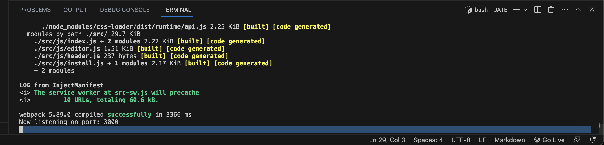
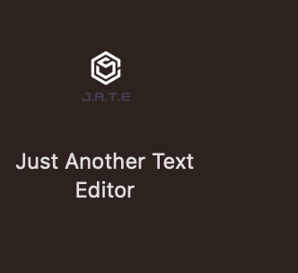
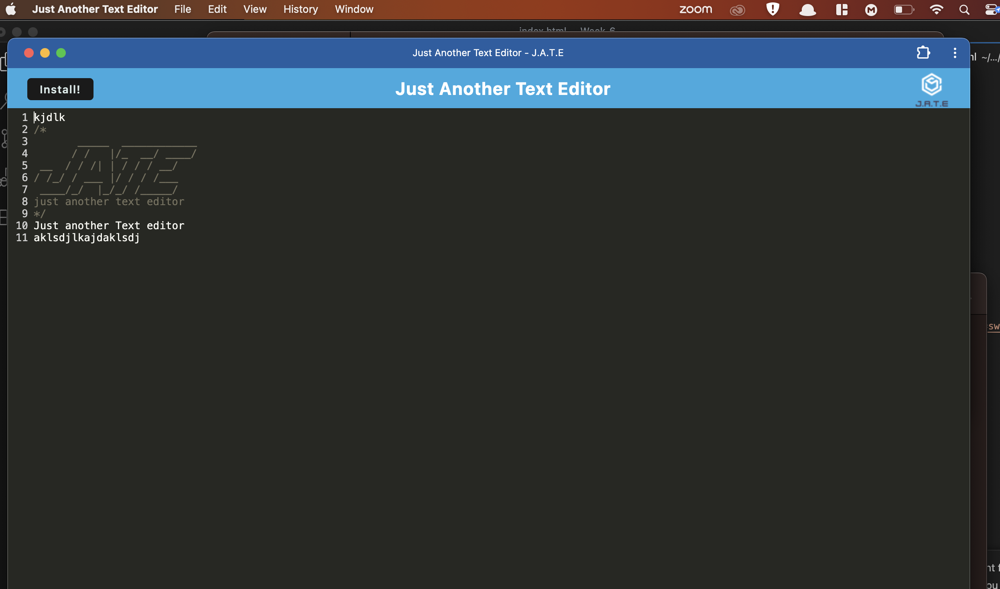

  # JATE

  ## Table of Content
  - [Project Description](#Description)
  - [Usage](#Usage)
  - [Installation](#Installation)
  - [Questions](#Questions)
  - [License](#Questions)
  ## Description
  This is a progressive web application where a user can create notes or code snippets with or without wifi. Because it is a progressive web application it can be installed to be used offline while maintaining all progress.
  ## Installation
  This application is deployed to render and can be used from there to write code snippets. When install is clicked it will create an application on computer and be used offline.

  The npm packages used are 
  ```
  * npm install express (express.js)
  * npm install --save-dev webpack (Webpack)
  * npm install webpack-dev-server --save-dev (webpack-dev-server)
  * npm install --save-dev webpack-pwa-manifest (WebpackPwaManifest)
  * npm install babel (Babel)
  * npm install --save-dev css-loader (CSS-loader)
  * npm install concurrently --save (run multiple commands concurrently.) (Concurrently)
  * npm npm install idb (IndexedDB)
  ```
  These can be installed by using npm install because they are in package.json.
  ## Usage 
  Once installed in the terminal use ``` npm run start``` to start our server it should look like this:
  
  Then, the browser can be opened and when install is clicked it will create a icon on desktop that can be opened like other applications:
  
  
  ## Demonstration video
  )

  ## Questions
  - Email: junior_poku@hotmail.com
  - Github: https://github.com/Junya_jp

  ## License  
  N/A
  

